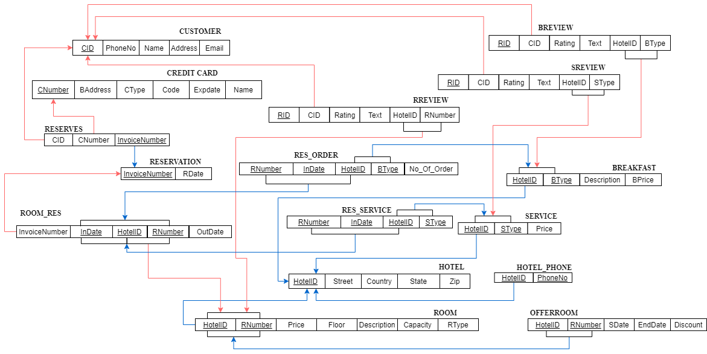
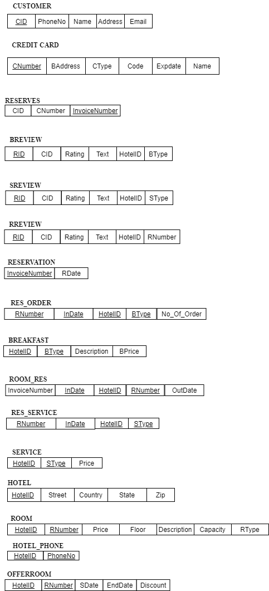

# Overview
This is the report for Team 1 for Project Delivery 2

## Teammates:
> **Course: CS 631, Section: 1J1 - Data Management System Design**

|member|email address|
|-|-|
|Susmita Biswas|sb78@njit.edu|
|Kranthi Gunuru|kg62@njit.edu|
|Shawn Cicoria|sc2443@njit.edu|


# Requirements
As provided in the assignment:
> Phase 2 Deliverable must contain the goal of this phase of the project, and a logical design of the database (resulting from the mapping of an EER schema to a Relational schema). Use the ER model provided as the solution of Phase 1 Deliverable to draw the Relational model in this phase. You must further describe the problems encountered in Phase 2 and justify the solutions.

# Goals
For Deliverable 2 of the term project, the team started with the solution enhanced Entity Relationship (EER) diagram provided by the professor.

## Steps and Approach
Leveraging the EER along with the ER-to-Relational mapping recipe provided:

### ER-to-Relational mapping algorithm
* step 1: mapping of regular entity types
* step 2: napping of weak entity types
* step 3: mapping of binary 1:1 relation types
* step 4: mapping of binary 1:N relationship types 
* step 5: mapping of binary M:N relationship types 
* step 6: mapping of multi-valued attributes 
* step 7: mapping of N-ary relationship types mapping EER model constructs to relations 
* step 8: options for mapping specialization or generalization 
* step 9: mapping of union types (categories) 

### Implementation
#### Step 1 - the following all become initial entities in the logical design.
```
Customer
Review
Breview
Sreview
Rreview
Hotel
CreditCard
Reservation
```

#### Step 2 - the following are linked and contain keys based upon the regular entity type plus its own identifier
```
Breakfast
Service
Room
Room_res
Offerroom
```

#### Step 5 - Breakfast to Room Reservation M:N
* We chose to create `"res_order"`` for connecting the two relations and using both of their keys
* Also chose to use `"invoiceNumber"`` for the key and relation from `Reservation` to `Room_Res` and `Reserves` --- potentially we could have used `HotelID + Rnumber + InDate` -- we avoided the composite key with a date.

#### Step 7 - Mapping n-ary relationship -

* We have created an entity for the ternary relation "Reserves" between- Credit Card, Customer, and Reservation.

#### Step 8
* For `Offerroom` we used 8A -- which is to create a single subclass of `Room`
* For `Review` we used 8B -- which is to create 3 generalizations of review, dropping review from Step 1-  based upon the type - this was most fitting given each had their own references to distinct Weak entities - `Breakfast, Service, and Room` respectively - of which each are their own entities in the logical design from above.


## Challenges and difficulties
* continued to use draw.io tool for the logical diagram: https://github.com/jgraph/drawio


# Logical Diagram



## Table Listing

